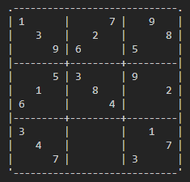
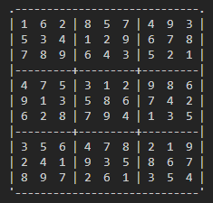

# Sudoku Solver

This program solves sudoku puzzles by testing each required integer, 1-9, in cells that do not have set values. It continues to test each value until a rule is violated, where it will backtrack and try the next increment.

## Methods

`boolean solveSudoku()`
>Returns true if all cells have been checked and contain valid numbers according to the rules. Returns false if the puzzle is not 9x9 or any set clue value breaks a rule itself.

`boolean isValid()`
>Returns true if all rules are followed with current number in the selected cell. A number must not be repeated in the current row, column, or 3x3 grid it is in.

`void printSudoku()`
>Prints the completed sudoku puzzle to the terminal.

